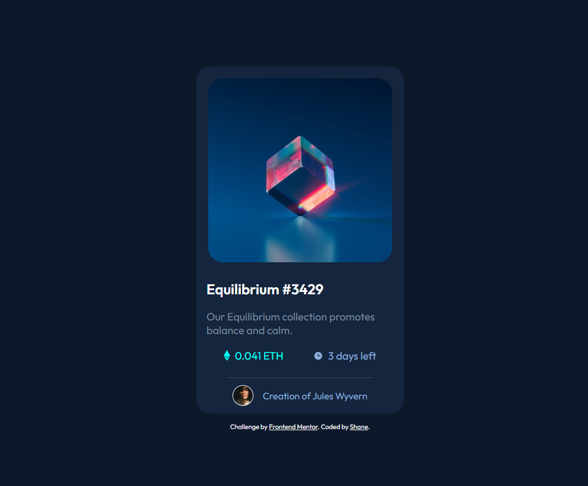

# Frontend Mentor - NFT preview card component solution

TThis is a solution to the [NFT preview card component challenge on Frontend Mentor](https://www.frontendmentor.io/challenges/nft-preview-card-component-SbdUL_w0U). Frontend Mentor challenges help you improve your coding skills by building realistic projects. 

## Table of contents

- [Overview](#overview)
  - [Screenshot](#screenshot)
  - [Links](#links)
- [My process](#my-process)
  - [Built with](#built-with)
  - [What I learned](#what-i-learned)
  - [Continued development](#continued-development)
- [Author](#author)

## Overview

### Screenshot

### Links

- Solution URL: [My Github Repo](https://github.com/splwdev/nft-preview-card)
- Live Site URL: [Published Github Pages Version](https://splwdev.github.io/nft-preview-card)

## My process

### Built with

- Semantic HTML5 markup
- CSS custom properties
- Flexbox

### What I learned

Afer 2 weeks of learning HTML / CSS I've definitely learnt a lot, and looking forward to my continued learning. On this project in particular, I've learnt more about the placement of HTML elements and the accompanying CSS to gain the desired outcome.

### Continued development

Still early in my journey, but am hoping to be able to complete these projects quicker and more easily as time moves on.

## Author

- Frontend Mentor - [@splwdev](https://www.frontendmentor.io/profile/splwdev)
